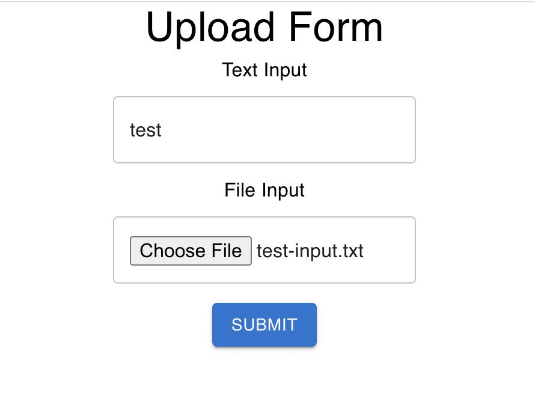

# Introduction
  This project is a basic React application that includes a text box, a file input option, and a submit button. It demonstrates the integration of various AWS services, including S3, API Gateway, Lambda, DynamoDB, and EC2.
# How It Works
 - User Interaction: The user enters text in the text box and selects a file to upload.
 

 - Submit Action: Upon clicking the submit button, the file is uploaded to an S3 bucket.

 - Data Storage: Through API Gateway and a Lambda function, the S3 file path and the input text are stored in a DynamoDB table.

 -  Stream Trigger: A new item added to the DynamoDB table triggers another Lambda function through Dynamo Stream.

 -  EC2 Instance Initiation: The triggered Lambda function initiates a VM of an EC2 instance.
 

 -  Script Execution: When the EC2 instance is loaded, a script runs that retrieves the input text and file path from DynamoDB, appends the text to the file, and saves it in the S3 bucket as output.txt. The file path of output.txt is also saved in DynamoDB.

# Configuration
## S3 Bucket Name: 
   - fileflow-s3 -> contains the input file
   - fileflow-script-bucket -> contains thes script to append input text to the inputFile.txt and save it as outputFile.txt

## DynamoDB Table Name: 
   - fileflow -> dynamodb responsible for storing the path of inputFile.txt and outputFile.txt
## Lambda Function Names: 
   - lambda-python -> contains the python script to store input file into s3 bucket
   - lambda-script -> contains the python script to trigger and destroy ec2 instance 

# Tools Used
    React
    AWS S3
    AWS API Gateway
    AWS Lambda
    AWS DynamoDB
    AWS EC2

# Installation and Setup:

## Clone the Repository:

git clone https://github.com/username/repository.git
Replace https://github.com/username/repository.git with the URL of the repository you want to clone.

## Navigate into the Project Directory:

cd repository
Replace repository with the name of the directory created when you cloned the repository.

## Install Dependencies:

npm install
This command will install the necessary dependencies specified in the package.json file.

## Run the Development Server:

npm start
This command will start the development server. Once it's running, you can view your React app in your browser at http://localhost:3000.

# AWS Credentials
- username: fovuschallenge
- password: @FovusFileflow2024
